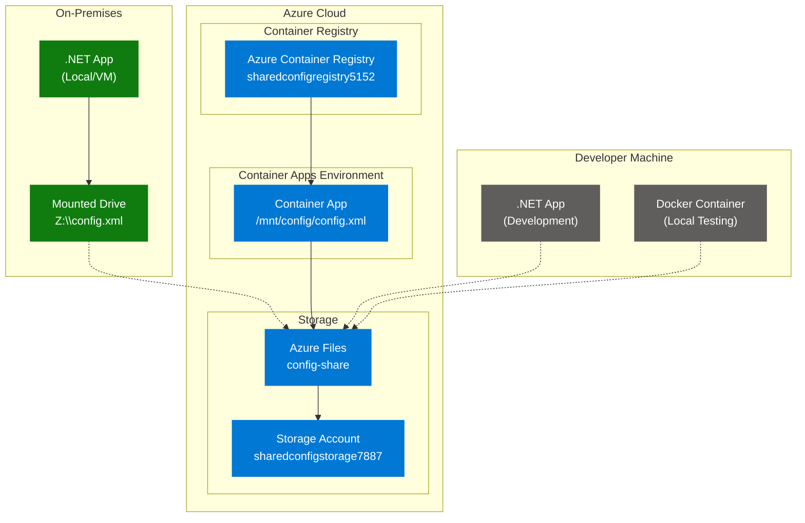

# Shared Configuration Management with Azure Files

A .NET 8.0 application demonstrating shared configuration management between on-premises and cloud environments using Azure Files as a centralized storage solution.

## 🏗️ Architecture Overview



## ✨ Features

- **Real-time Configuration Sharing**: Changes made in one environment are immediately available to all others
- **Cross-Platform Support**: Works on Windows, Linux, and containerized environments
- **Web Interface**: User-friendly dashboard for viewing and editing configuration
- **File Monitoring**: Automatic detection of external configuration changes
- **Cloud-Native**: Designed for Azure Container Apps with Azure Files integration
- **Scalable**: Supports multiple container instances sharing the same configuration

## 🛠️ Technology Stack

- **.NET 8.0**: Web application framework
- **ASP.NET Core Razor Pages**: Web UI
- **Azure Container Apps**: Cloud hosting platform
- **Azure Files**: Shared file storage
- **Azure Container Registry**: Container image storage
- **XML Configuration**: Simple, human-readable config format
- **File System Watcher**: Real-time change detection

## 📁 Project Structure

```
SharedConfigApp/
├── Models/
│   └── ConfigModel.cs              # Configuration data model
├── Services/
│   └── ConfigService.cs            # Configuration management service
├── Pages/
│   ├── Index.cshtml                # Configuration dashboard
│   ├── Index.cshtml.cs             # Dashboard page model
│   ├── Edit.cshtml                 # Configuration editor
│   ├── Edit.cshtml.cs              # Editor page model
│   └── Shared/
│       ├── _Layout.cshtml          # Layout template
│       ├── _ViewStart.cshtml       # View configuration
│       └── _ViewImports.cshtml     # Common imports
├── SharedData/
│   └── config.xml                  # Local configuration file (development)
├── Program.cs                      # Application entry point
├── appsettings.json                # Application settings
├── appsettings.Development.json    # Development settings
├── Dockerfile                      # Container configuration
├── docker-compose.yml              # Local multi-instance testing
└── README.md                       # This file
```

## 🚀 Quick Start

### Prerequisites

- [.NET 8.0 SDK](https://dotnet.microsoft.com/download/dotnet/8.0)
- [Azure CLI](https://docs.microsoft.com/en-us/cli/azure/install-azure-cli)
- [Docker Desktop](https://www.docker.com/products/docker-desktop/) (optional)
- Azure Subscription

### Local Development

```bash
# Clone the repository
git clone <your-repo-url>
cd SharedConfigApp

# Run locally
dotnet run

# Access the application
# Navigate to https://localhost:7xxx (check console for exact port)
```

### Local Multi-Instance Testing

```bash
# Test multiple instances sharing configuration
docker-compose up

# Access instances:
# http://localhost:8080 (instance 1)
# http://localhost:8081 (instance 2)
```

## ☁️ Azure Deployment

### Automated Deployment

```powershell
# Run the deployment script
.\deploy-to-azure-simple.ps1
```

### Manual Deployment

#### 1. Create Azure Resources

```powershell
# Set variables
$RESOURCE_GROUP = "rg-shared-config"
$LOCATION = "eastus"
$STORAGE_ACCOUNT = "sharedconfigstorage$(Get-Random -Minimum 1000 -Maximum 9999)"
$FILE_SHARE = "config-share"
$ACR_NAME = "sharedconfigregistry$(Get-Random -Minimum 1000 -Maximum 9999)"

# Create resource group
az group create --name $RESOURCE_GROUP --location $LOCATION

# Create storage account
az storage account create --name $STORAGE_ACCOUNT --resource-group $RESOURCE_GROUP --location $LOCATION --sku Standard_LRS

# Create file share
$STORAGE_KEY = az storage account keys list --resource-group $RESOURCE_GROUP --account-name $STORAGE_ACCOUNT --query "[0].value" -o tsv
az storage share create --name $FILE_SHARE --account-name $STORAGE_ACCOUNT --account-key $STORAGE_KEY

# Upload initial configuration
az storage file upload --share-name $FILE_SHARE --source ".\SharedData\config.xml" --path "config.xml" --account-name $STORAGE_ACCOUNT --account-key $STORAGE_KEY
```

#### 2. Container Registry and Image

```powershell
# Create container registry
az acr create --resource-group $RESOURCE_GROUP --name $ACR_NAME --sku Basic

# Build and push image
az acr build --registry $ACR_NAME --image shared-config-app:latest .
```

#### 3. Container Apps Environment

```powershell
# Create environment
az containerapp env create --name shared-config-env --resource-group $RESOURCE_GROUP --location $LOCATION

# Configure Azure Files storage
az containerapp env storage set --name shared-config-env --resource-group $RESOURCE_GROUP --storage-name config-storage --azure-file-account-name $STORAGE_ACCOUNT --azure-file-account-key $STORAGE_KEY --azure-file-share-name $FILE_SHARE --access-mode ReadWrite
```

#### 4. Deploy Container App

```powershell
# Deploy the application
az containerapp create --name shared-config-app --resource-group $RESOURCE_GROUP --environment shared-config-env --image "$ACR_NAME.azurecr.io/shared-config-app:latest" --target-port 8080 --ingress external --registry-server "$ACR_NAME.azurecr.io" --registry-identity system --cpu 0.25 --memory 0.5Gi --min-replicas 1 --max-replicas 5

# Configure volume mount
az containerapp update --name shared-config-app --resource-group $RESOURCE_GROUP --yaml containerapp.yaml
```

## 🔧 Configuration

### Application Settings

| Setting | Development | Production | Description |
|---------|-------------|------------|-------------|
| `SharedConfigPath` | `SharedData/config.xml` | `/mnt/config/config.xml` | Path to configuration file |
| `ASPNETCORE_ENVIRONMENT` | `Development` | `Production` | Application environment |
| `ASPNETCORE_URLS` | `https://localhost:7xxx` | `http://+:8080` | Application URLs |

### Configuration File Structure

```xml
<?xml version="1.0" encoding="utf-8"?>
<configuration>
  <appSettings>
    <add key="AppName" value="Shared Config Demo" />
    <add key="DatabaseConnection" value="Server=localhost;Database=MyApp;" />
    <add key="ApiTimeout" value="30" />
    <add key="EnableLogging" value="true" />
    <add key="MaxUsers" value="100" />
  </appSettings>
</configuration>
```

## 🧪 Testing Shared Configuration

### Scenario 1: Cloud-to-Cloud Sharing

1. **Deploy multiple container instances**:
   ```powershell
   az containerapp update --name shared-config-app --resource-group rg-shared-config --min-replicas 2
   ```

2. **Test configuration sharing**:
   - Open the application URL in two browser tabs
   - Edit configuration in one tab
   - Refresh the other tab to see changes immediately

### Scenario 2: On-Premises Integration

1. **Mount Azure Files on Windows**:
   ```cmd
   net use Z: \\{storage-account}.file.core.windows.net\config-share /user:Azure\{storage-account} {storage-key}
   ```

2. **Update local configuration**:
   ```json
   {
     "SharedConfigPath": "Z:\\config.xml"
   }
   ```

3. **Run locally and test**:
   ```bash
   dotnet run
   ```

### Scenario 3: Container-to-Local Sharing

1. **Edit configuration via web interface** in the cloud
2. **Monitor changes locally** by refreshing your local application
3. **Verify file updates** in Azure Files storage

## 📊 Monitoring and Troubleshooting

### View Application Logs

```powershell
# Real-time logs
az containerapp logs show --name shared-config-app --resource-group rg-shared-config --follow

# Historical logs
az containerapp logs show --name shared-config-app --resource-group rg-shared-config
```

### Check Configuration File

```powershell
# List files in Azure Files
az storage file list --share-name config-share --account-name {storage-account}

# Download current configuration
az storage file download --share-name config-share --path config.xml --dest current-config.xml --account-name {storage-account}
```

### Common Issues

| Issue | Symptom | Solution |
|-------|---------|----------|
| Configuration not updating | Changes don't reflect across instances | Check Azure Files mount and permissions |
| File not found errors | Application fails to start | Verify file share and mount path configuration |
| Permission denied | Cannot write to configuration file | Check Azure Files access mode and storage key |
| Container image not updating | Code changes not reflected | Force new revision deployment |

## 📈 Scaling and Performance

### Horizontal Scaling

```powershell
# Scale container app instances
az containerapp update --name shared-config-app --resource-group rg-shared-config --min-replicas 2 --max-replicas 10

# Configure auto-scaling rules
az containerapp update --name shared-config-app --resource-group rg-shared-config --scale-rule-name http-requests --scale-rule-type http --scale-rule-metadata concurrentRequests=50
```

### Performance Considerations

- **File Caching**: Application caches configuration in memory for performance
- **Change Detection**: Uses FileSystemWatcher for efficient change monitoring
- **Network Latency**: Azure Files access is optimized for cloud environments
- **Concurrent Access**: Multiple instances can safely read/write simultaneously

## 🔒 Security

### Access Control

- **Storage Account**: Secured with access keys and network restrictions
- **Container Registry**: Uses managed identity for authentication
- **Application**: No hardcoded credentials in configuration
- **Azure Files**: Supports Azure AD authentication and RBAC

### Best Practices

- Rotate storage account keys regularly
- Use managed identities where possible
- Implement network security groups for access control
- Monitor file access through Azure Monitor

## 🌐 Production Considerations

### High Availability

- **Multi-region deployment**: Deploy across multiple Azure regions
- **Storage replication**: Use geo-redundant storage for Azure Files
- **Container Apps**: Built-in high availability and automatic failover

### Backup and Recovery

```powershell
# Create backup of configuration
az storage file download --share-name config-share --path config.xml --dest backup-$(Get-Date -Format "yyyyMMdd").xml --account-name {storage-account}

# Restore from backup
az storage file upload --share-name config-share --source backup-config.xml --path config.xml --account-name {storage-account}
```

## 🤝 Contributing

1. Fork the repository
2. Create a feature branch (`git checkout -b feature/amazing-feature`)
3. Commit your changes (`git commit -m 'Add amazing feature'`)
4. Push to the branch (`git push origin feature/amazing-feature`)
5. Open a Pull Request

## 📄 License

This project is licensed under the MIT License - see the [LICENSE](LICENSE) file for details.

## 🆘 Support

- **Documentation**: Check this README and inline code comments
- **Issues**: Create an issue in the repository
- **Azure Support**: Use Azure support channels for platform-specific issues

## 🎯 Use Cases

### Enterprise Scenarios

- **Multi-environment configuration**: Development, staging, and production
- **Microservices coordination**: Shared settings across service boundaries
- **Feature flags**: Dynamic feature enablement across environments
- **API configuration**: Centralized endpoint and key management

### Development Scenarios

- **Team collaboration**: Shared development settings
- **Local testing**: Consistent configuration across team members
- **CI/CD integration**: Automated configuration deployment
- **Environment parity**: Consistent settings from development to production

---

## 🏆 Success Metrics

After successful deployment, you should achieve:

- ✅ **Real-time synchronization**: Configuration changes appear instantly across all instances
- ✅ **Zero-downtime updates**: Configuration changes without application restart
- ✅ **Cross-platform compatibility**: Works on Windows, Linux, and containers
- ✅ **Scalable architecture**: Supports multiple instances and environments
- ✅ **Centralized management**: Single source of truth for configuration

**Live Demo**: Your application is running at `https://shared-config-app.thankfulwave-1ed6ca2d.eastus.azurecontainerapps.io`